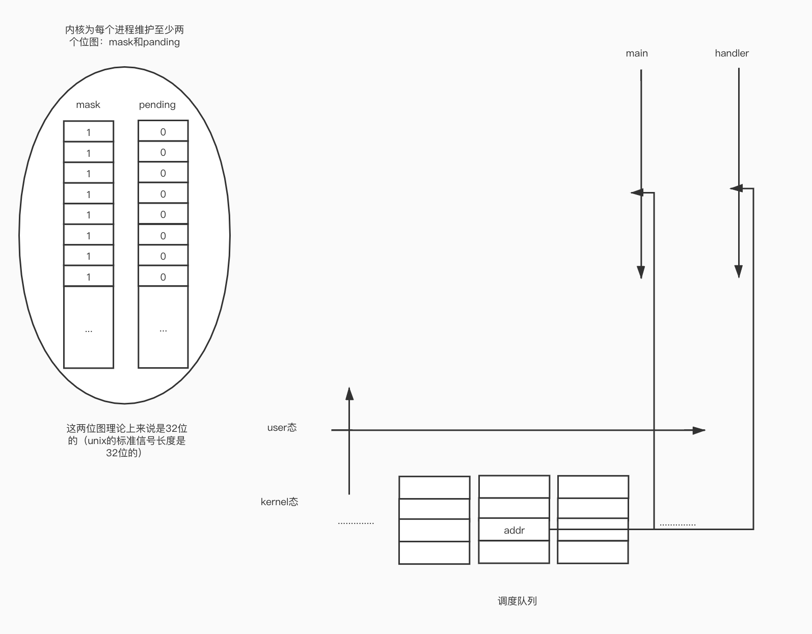

# 并发

- 同步：所有分支都在你的控制中（所有要进行的操作在你的预料之中）
- 异步：这个事件什么时候发生，你并不知道，这个异步事件的到来会引发什么你并不知道。
  
- 异步事件的处理：查询法，通知法
    1. 查询法：盲目的定期查询（拿筛子定期去筛）。
    2. 通知法：浮标钓鱼，有鱼上钩浮标会通知我。

发生的频率比较稀疏，用通知法，如果比较频繁，用查询法。实际上并没有彻彻底底的通知法。

 ***注意：开发的时候千万不可混用线程和进程的并发！！***

## 信号
1. 信号的概念：
   - 信号是软件（层面的）中断
   - 信号的响应依赖于中断（有了中断，信号才能被响应）
   - ```kill -l``` 可以查看当前的信号。 
   - 信号分为标准信号和实时信号。(1-31是标准信号)
   - core文件是程序的某个现场，一般是出错现场。（一般我们使用的程序出错的时候，发送的错误报告就是core文件）
2. ```signal()```
   - ```void (*singal(int signalnmuber,void (*func)(int)))(int)``` 注意多写这个原型（防止名空间冲突），不要写man手册里面的那个，标准的头文件里面根本没有定义，所以用的时候要加上typedef，如果另外一个库里面也有这个东西那么就game over了（c没有名空间）。函数的含义：指定一个信号num,以及一个行为handler。
   - handler 可以是宏，也可以是一个函数的入口地址。
   - ```ctrl + c``` = SIGINT。```ctrl + \``` = SIGQUIT。
   - handler响应有两个条件，1）程序没结束 2）信号到来
   - 重要：***信号(handler)会打断阻塞的系统调用***
3. 信号的不可靠
   - 标准信号一定会丢失的，这不算是信号不可靠。
   - 信号不可靠指的是信号的**行为**不可靠，你没有人为去调用一个信号handler，而是当信号传来了，它自动发生的。那么当一个信号在处理的过程中又来了一个新的信号。由于执行现场是内核帮你布置的，这些信号的现场很有可能被布置在同一个位置，那么第二个信号来的时候很有可能把第一个信号的现场给冲掉。
4. 可重入函数
   - 为了解决信号的不可靠。
   - 第一次调用还没结束，就发生了第二次调用，并且不会产生错误。
   - **所有的系统调用都是可重入的。一部分标准库函数也是可重入的**，如：```memcpy()```（拷贝内存空间）,单也有部分标准库函数是不可重入的，如：```rand()```,对于这类函数，标准库又给出了一部分对应的可重入函数（可见man手册 这部分的函数的_r后缀的函数就是可重入的），不可重入的函数不可用于信号处理。
5. 信号的响应过程
   -  mask:信号屏蔽字，用来表示当前的信号的状态
   -  pending：用来记录收到哪些信号
   -  信号从收到到响应有一个不可避免的延迟。
   -  当一个进程被中断的时候，保存现场，压栈（扎入kernel态），然后，调度到你的时候，又从kernel态回到user态，还原现场。这个时候非常重要，要做一个表达式 mask&pending ，如果发现整个值等于0，那么就证明没有被中断。如果一个进程在运行的过程接收到一个信号 SIG_INT，那么就会反映到pending的一个位上，原本是0，那么就这个位会变成1。一切照常进行，正常中断，调度，当从k态回到u态的时候做 mask & pending 发现有中断。那么就执行对应的 handler。所以信号是有延迟的！！没有中断打断你，你就没办法看到信号：信号是依赖中断这个机制来响应的。
   -  那么信号响应的过程是怎么样的呢：如果收到了一个信号，把对应的位的mask 和 pending都置成0，然后换掉原来的返回地址addr,用handler的地址来替换，进入到handler中进行。响应完之后又回到内核，把刚刚更改的地址换回来。把mask对应位置成1。继续执行。（此时不知道对应的pending位是多少）
   -  如果接收了多个标准信号，是没有顺序的。先执行哪个后执行哪个并不知道。**标准信号的响应没有严格的顺序**
   -  **信号是从 k->u的路上响应的**
   -  思考：如何忽略掉一个信号的？```SIG_IGN```当作handler传入，把对应的mask位置成0，这个信号就会被忽略。你不能阻止信号的到来，但是可以决定是否对信号做出响应。
   -  思考：标准信号为什么要丢失？位图，来一万个1不还是1么，同一个**标准信号**是肯定会丢失的。
   
6. 信号相关的常用函数
   - ```kill()```：用于发信号。pid: >0 , =0(组内广播) , =-1(全局广播) , <-1(对应组广播)  
   - ```raise()```：相当于给当前进程发送一个signal
   - ```alarm()```：（时钟）定一个时延来发信号,没有办法实现多任务计时（多个alarm会出问题）（只有最后一个会生效）**注意**：只要是设置信号行为的操作一定要定义在```alarm()```之前。【例】：使用单一计时器来构造一组函数。 我实现任意数量的计时器。
   - ```pause()```：暂停，等待一个信号。考虑到移植性，尽量不要使用sleep因为有一些平台是用alarm + pause封装的sleep,会有问题的，alarm没法实现多个任务计时，如果用了sleep后又用一个alarm会出大问题。如果用循环来等待的话cpu的占用率会很高，因为在一直执行循环语句，pause可以用来作为等待，这个系统调用可以被信号打断
   - ```abort()```：人为的制造一个异常。
   - ```system()```：如果在有信号相关的进程中使用```system()```的话要block掉以一个信号ignore掉两个信号（具体看man手册）。实际上这个函数就是调用```/bin/sh```来完成你的命令。
   - ```sleep()```：缺点：有些平台的sleep是用alarm+pause封装的。所以说用一个以上的alarm是会出问题的。所以说尽量少用sleep。可以用```nanosleep()```和```usleep()```和```select()```来替换它，
   - 漏桶：无论来海量数据都不紧不慢的读，如果没有数据了，那就闲着。
   - 令牌桶：积攒权限，一次使用。使用万积攒的权限之后就恢复正常。
7. 信号集 ```man sigemptyset```自行查看
   - 信号集类型：```sigset_t```
   - ```sigemptyset()```
   - ```sigfillset()```
   - ```sigaddset()```
   - ```sigdelset()```
   - ```sigismemberset()```
8. 信号屏蔽字/和信号判定集的处理
   - ```sigprocmask()```:给了我们人为的方式来干扰信号。我们可以决定信号什么时候可以被响应。记住，怎么进来，怎么出去。
9.  扩展函数
   - ```sigsuspend()```
   - ```sigaction()```
   - ```setitimer()``` ：用到时钟的时候，尽量使用这个而不是alarm。优点：误差不累积。
11. 实时信号


## 线程
