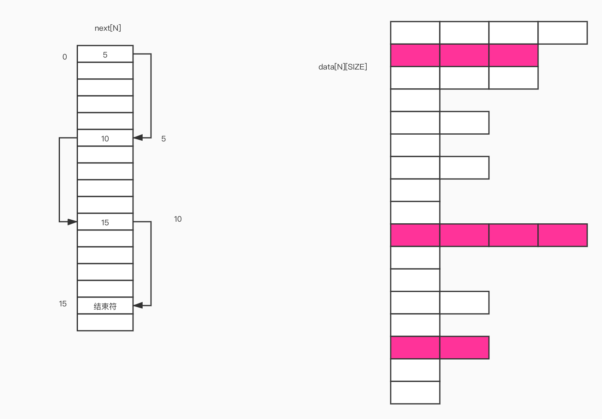

# 文件系统

- 递归需要设置一个上限，如果到达这个上限还没结束就应该退出或者报错。防止栈崩坏。

## 目录和文件
- 类似ls的实现（不做颜色的要求），如myls -a -l -n的实现。
1. 获取文件属性
    - cmd --长格式 -短格式 非选项传参 (命令行实现)
    - 命令行不能直接对类似 ```-a``` 这样的 **文件名** 作操作，需要在前面加上 ```--``` 表示格式选项结束，或者加上一个路径比如```./``` 才可以把名为 ```-a``` 这样的文件进行操作。 
    - 文件属性获取函数：```stat()``` ```fstat()``` ```lstat()```
    - ```stat()``` ：通过文件路径获取属性，面对符号链接文件时候，获取的是所指向目标文件的属性。
    - ```fstat()``` ：通过文件描述符获取属性
    - ```lstat()``` ：面对符号链接文件时获取的是符号链接文件的属性。
    - 在库文件的路径下 vim -t ```想要查询的名字（结构体或函数名）``` 可以看到源码。
    - ```st_size``` 在unix中只是一个 **值**，而 ```blksize``` 和 ```blocks``` 才表现所占磁盘的大小
    - ```cp``` 命令支持空洞文件拷贝（快速拷贝空洞文件）。·```cp``` 具体做法是，读文件，如果发现是空字符，那么不写，只记录个数，一直读，如果读到最后都是空字符，那么不执行写操作，直接一个 ```lseek``` 拉到文件末尾，所以```cp``` 拷贝空洞文件相对而言不那么费时间。 而且拷贝出来的文件不占空间。 

2. 文件访问权限
    - 在文件访问权限 **-rwx-rwx-rwx** 在第一个权限信息之前是一个```-``` 代表了文件的类型。
    - 如果是单字符返回返回类型最好设为int，而不是char，因为char对负数是没有定义的。
  
3. 文件类型（7种）```st_mode``` 是一个16位（```int```）的位图用来表示文件类型和访问权限
    dcb-lsp
    | 文件类型 |       类型说明        |
    | :------: | :-------------------: |
    |    d     |   dirctory目录文件    |
    |    c     | character字符设备文件 |
    |    b     |    block块设备文件    |
    |    -     |    regular常规文件    |
    |    l     |   link符号链接文件    |
    |    s     | socket网络套接字文件  |
    |    p     | pipe（命名）管道文件  |

    查看 ```man``` 手册来了解 ```st_node``` 的更多用法！！！（位图判断类型和权限） ，两种方式判断文件属性（类型和权限）
    1. 用 **宏** ```ISDIR()``` 等函数。
    2. 用位图。

4. umask 
   - umask 可以用命令 ```umask``` 来设置 umask的值。主要用于防止产生权限过松的文件。
  
5. 文件权限的更改/ 管理 ```chmod()``` ```fchmod()```
   - ```chmod()``` 可以用来设置权限如：666 664 600 之类的。还有添加权限的做法，具体请查看manual
  
6. 粘住位（t位）
   - 用处：原本在内存中保留文件的使用痕迹，下次装载的时候会比较快。
   - 现在更多的用法用法主要是给一个目录作t位设置。
  
7. 文件系统：FAT ,UFS
   - 文件系统：文件或数据的存取和管理问题
   - FAT16/32:静态存储的单链表，类似以下代码。
        ```c++
        struct fileNode{
            int next[N];
            char data[N][SIZE];
        }
        ```
        1. 其实实际更复杂，不够大概思想如下。
        
        一个文件占用```data[N][SIZE]``` 位置的空间，如果一个空间存不完，那么，那么他的 ```next``` 域会继续寻找下一个空间。直到 ```next``` 域不指向下一个空间（文件结束）。
        FAT文件系统之所以存放大小有限是因为N的大小是有限的。为什么要分区，以为FAT文件系统承载能力有限。而且FAT文件系统是一式两份的，因为怕出错，会做对照。
        1. 因为是单链表，所以没有回头路，是其中一个缺陷。
        2. 【小实验：试着自己实现一个FAT文件系统】
        3. 手机杀内存软件小知识(吃内存进程，把内容放到swap分区，需要的时候再取出来，从swap分区读的速度和在内存中相比差20万倍)，如果唤入量和唤出量都在上升才说明内存满。
   - UFS文件系统：
        1. 分区有什么用？其实用处不大，磁盘拿文件的时候并没有那么蠢，是用电梯算法，全部拿进来，再排序。所以分不分区差别不大。
        2. 优点，不怕大文件。
        3. 缺点，小文件过多，导致 ```inode``` 块用尽，而数据块的那块只用了一点点空间。这样一来小文件的查找会慢一些。
        4. 文件名存储在一个叫 **目录文件** 的文件中。此文件的每条内容叫 ***目录项***。每条目录项包含 ```inode``` 信息和 ```fname``` 文件名。目录文件存在于任何一个目录下。
        5. 【面试题：不用判断语句判断两个数大小】
   
8.  **硬链接**，**符号链接**
       - 硬链接```link```  命令```ln```：硬链接。实际上就是添加一个目录项，同一个inode，只不过多了一个fname。删除第一个fname并不会导致文件的删除，要把全部连接到同一个inode的fname全部删除才会删除该inode（真正的删除该文件）。在link的时候其源文件link数（硬链接数会增加）。
       - 硬链接与目录项是同义词，且硬链接的建立有限制，不能给分区建立硬链接，不能给目录建立。（如果可以跨分区建立那inode就会相同）
       - ```ln -s``` 符号链接。可以理解为Windows里面的快捷方式。会创建一个新的inode（与原来的inode不同）,其硬链接数与源文件相同，所占size为fname的长度。如果删除源文件，那么无法再用该新链接产生的fname访问。
       - 符号链接可以给分区建立，可以给目录建立。
       - ```unlink``` 可以用于创建匿名文件。```open()```一个文件之后，可以直接用```unlink```这样之后不会再在目录下看到这个文件，但他实际上没有被删除，必须到 ```close()```执行后才会被删除。
       - ```remove()``` ，命令```rm``` 就是用它封装的。```unlink```是不能删除根目录的，这个可以。
       - ```rename()```,命令```mv``` 就是用它封装的，如果放在同一目录那么相当于改名操作，如果放在不同目录那么就相当于 ```location```(改变位置)。
  
9.  ```utime()```
    - utime函数可以用来更改一个文件的 ```atime``` 和 ```mtime```。也就是最后读时间和最后写时间。（不常用）
    
    
10. 目录创建和销毁
        - mkdir
        - rmdir(must be empty)
    
11. 更改当前工作路径
        - cd
        - 用 ```chdir()```来封装：修改当前进程的工作路径。
        - ```fchdir()``` 安全性有问题，能够突破假根目录 ```chroot```。
        - ````getcwd()``` 用来封装 ```pwd``` 。获取当前工作路径。
    
12. 分析目录/读取目录内容 （分解目录：**递归**）```glob()``` ```opendir()``` ```closedir()``` ```readdir()``` ```rewinddir()``` ```fseekdir()``` ```seekdir()``` ```telldir()```
    - ```glob()```：shell环境下是不解析*的，*会被当作是通配符（模式patten）。```glob()``` 能实现以上所有函数的内容。就是解析模式/通配符
    - ```opendir()```：是指通过一个流来打开一个文件目录 ```DIR * ```。
    - 命令```du``` 用来查看当前文件目录下的大小（可以根多个文件，也可以直接用 ```du``` 查看所在根目录的所有文件共占多少） 以K为单位。
    - 对于32位机器来说 ```st_blocks /2``` 就是文件的K数，对于64位机器来说 ```st_blocks``` 就是文件K数。
    - 【作业，用非 ```glob()``` 函数完成一下mydu】:```strchr()``` 小函数，特别好用。
    - 递归优化：只要一个变量的使用，单纯的在递归点之前，可以被优化为静态区内使用。

## 系统数据文件和信息
1. ```/etc/passwd```
   - ```getpwuid()```，```getpwnam()```
2. ```/etc/group```
   - ```getgrgid()``` ```getgrgrnam()```
3. ```/etc/shadow``` :加密的口令文件
   - root用户在操作系统就是神一般的存在，什么权限都有。除了一个文件没有x权限，root不能让他运行取来以外，root基本上什么都能做。
   - ```getspnam()``` 可以通过一个username在shadow文件中获取一行内容。
   - ```crypt()``` 加密
   - ```getpass()``` 改变设备属性，把回显功能去掉，输入口令后，再打开。
   - BLOW 应用密码学。
4. 时间戳 ```time_t```, ```struct tm```，```char*```
   -  ```time()``` 从内核取出来一个大时戳（大整数）```time_t```
   -  ```gmtime()``` 把大时戳转化成结构体 ```struct time``` 格林威治时间
   - ```localtime()``` 把大时戳转化成结构体 ```struct time``` 本地时间
   - ```mktime()``` 把```struct time``` 转化为大时戳。
   - ```strftime()``` 把```struct time```转化为字符串(格式化时间)。仔细看man手册。

5. 【小程序】
   - time log：写一个关于程序的time log
   - 

## 加密
1. hash：混淆 不可逆 。如果源串相同，所得串也相同，管理员监守自盗
2. 加密 - 解密 ：是可逆的。
3. 在计算机的世界没有绝对安全：穷举法 - 口令随机校验（随机连续两次才）。
4. 加密：安全？ -> 攻击成本远大于收益。
5. ```shadow``` 三个$，第一个$后跟加密方式，第二个$后跟杂字串，第三个$后面跟加密后的信息。


## 进程环境 
1. ```main()```
2. 进程的终止（背！！非常重要！！）
   - 正常终止：
   - - 从 ```main()``` 函数返回。（返回给父进程）```echo $?``` 查看上一个进程的返回结果。
   - - 调用 ```exit()```（库函数） ```status & 0377``` -128～+127。一共256种情况。
   - - 调用 ```_exit()``` 或 ```_Exit```（系统调用）
   - - 最后一个线程从启动例程返回：把进程当作是一个容器，那么当里面所有的线程都跑完了，那么这个进程也就结束了。
   - - 最后一个线程调用```pthread_exit()```
   - 异常终止
   - - 调用 ```abort()```
   - - 接到一个信号并终止
   - - 最后一个线程对其取消请求做出响应。

    ```atexit()``` ：钩子函数：注册一个函数，这个函数在进程终止的时候被调用。（调用是以声明的逆序执行），特别像析构函数！```on_exit``` 大同小异。

    调用```exit()``` 会调用钩子函数，执行IO清理等操作。而```_exit()```并不会。为了防止错误扩散可以用 ```_exit()```。

3. 命令行参数的分析
   - ```getopt()``` ```getopt_long()``` 几乎所有shell命令行的分析都是这俩函数。（选项，非选项参数）
   - ```getopt()``` 会将所有的参数重新排列，选项在前，非选项在后，全局变量```optind``` 是记录参数的当前位置。同时注意 linux下的```getopt()``` 会将参数重新排序，所有选项参数排在前面，非选项参数排在后面。如果读完了所有选项参数，只剩下非选项参数，会返回 ```-1``` （读取结束或出现异常）。而Mac下的 ```getopt``` 是个残废函数，只能把非选项参数放到后面，否则会出错。
  
4. 环境变量
   - ```main()``` 最早是三参数的，最后一个参数是环境变量
   - 环境变量的实质就是 ```key=value``` 可以用命令 ```export``` 来查看
   - 所以我们在用命令的时候其实是跟 ```path``` 环境变量有关系，它可以使得我们不需要填写上完整的路径名来使用命令。
   - 其实是程序员和管理员之间的约定。
   - ```environ``` 相当于一个全局变量，用于存放我们所有的环境变量。是一个字符指针数组。
   - ```getenv()``` 获取环境变量值。输入一个关键字，返回一个value值。
   - ```setenv()``` 输入一个K-V 和一个flag，修改该K的V。（若是替换的话，会删掉原来的，在堆上新创建一个空间，然后指针指向他）
   - ```putenv()``` 要一整个串，格式为 ```path=value``` （不好用，有可能被修改，没有const修饰）。
  
5. C程序的存储空间布局
   - 命令```pmap``` 可以查看指定进程号的程序空间。
6. 库
   - 动态库
   - 静态库
   - 手工装载库：内核模块，内核是模块化加载的（类似插件） ```dlopen()``` ```dlerror()``` ```dlsym()``` ```dlclose()```
   - 注意，在c99标准中，void* 转化为一个函数指针是 ***为定义*** 行为。


7. 函数跳转
   - ```goto``` 不能实现跨函数跳转，会破坏当前的函数的模块化结构，但是特殊情况还是可以用其思想。
   - ```setjmp()``` （安全实行跨函数跳转）执行一次返回两次，如果正常返回那么返回0，如果是别的函数跳转，那么返回非0.
   - ```longjpm()``` （安全实行跨函数跳转）


8. 资源的获取以及控制
   - ```getrlimit()``` 命令ulimit就是这两函数封装的。 普通用户不可改变硬限制
   - ```getrlimit()``` 普通用户不可升高硬限制，可以降低。对于软限制，可以升高可以降低，但是不可以高于硬限制。root用户可以任意升高降低。


