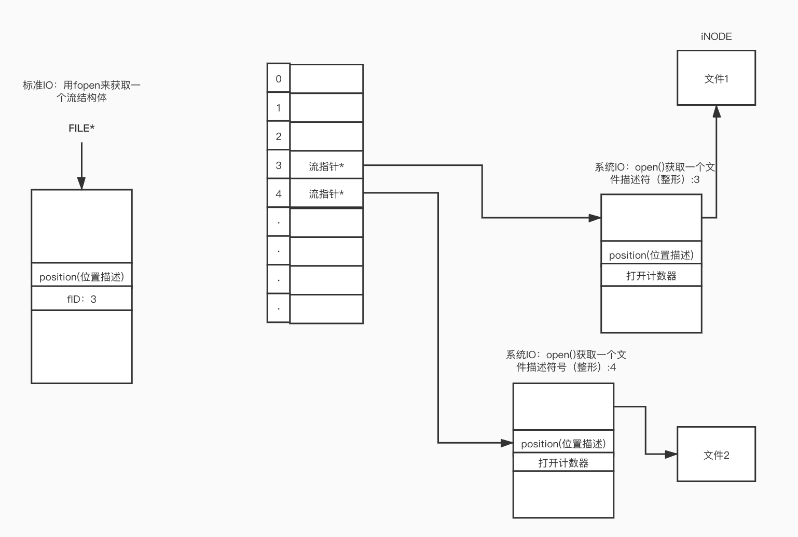

# 文件IO/系统调用IO

## 文件描述符：

- 文件描述符是一个整形 ```int``` （是数组的下标），文件描述符跟标准IO不一样，使用 ```open()``` 的时候不会返回一个流指针FILE，而是把这个指针存在了一个数组里面，给你返回一个数组的下标。

    

- 文件描述符优先使用当前可用范围内最小的一个。

- 每打开一个流对于 ```FILE*``` 来说，都会打开3个流，这三个流分别是 ```stdin``` ```stdout``` ```stderr``` 。对于系统IO来说也是这样子的，他的存储文件描述符的数组的第0，1，2个位置是用来存放这个三个标准流的（默认情况下），一般来说都是从父进程那里继承下来的。也可以直接从0位置开始存储文件描述符。
  
- 文件描述符数组存在于每一个进程里，每一个进程都会有一个这样的数组。不同的进程打开同一个文件会产生不同的多个文件描述符号，存在自己的文件描述符数组里面。

- 同一个进程打开一个文件两次会产生两个不同的文件描述符结构体，互不影响，即使其中一个文件描述符执行了```close()``` 操作，另外一个文件描述符结构体依然可以访问文件。因为是不同的文件描述符结构体。

- 就算同一个文件描述符，被复制了一份放到文件描述符数组里面（文件描述符数组里面有两个指针都指向同一个文件描述符结构体），关闭其中一个这个结构体也不会被 ```free``` 掉，，因为文件描述符里面有一个计数器变量，记录着被打开了多少次，当这个计数器为0的时候，文件描述符对象才会被销毁。


## 文件IO的操作 ： ```open()``` ```close()``` ```read()``` ```write()``` ```lseek()``` 

- cache是读的缓冲机制，buffer是写的缓冲机制

- 文件操作权限对应如下
  标准IO | 系统IO
  :-:|:-:
  r|O_RDONLY
  r+|O_RDWR
  w|O_WRONLY 位或 O_CREATE 位或 O_TRUNC
  w+|O_RDWR 位或 O_CREATE 位或 O_TRUNC
  想要这个权限又想要那个权限，那就按位或，如果测试权限那就按位与。
  

## 文件IO与标准IO的区别

- 标准IO有缓冲机制（邮局老大爷），***吞吐量高*** ，合并系统调用。
- 文件IO是直接执行（实时性非常的高），***响应速度块***。
- 【面试：如何让一个程序速度变快？】
- 【从用户角度来体验的话：其实是吞吐量变大会更快】
- 【能用标准IO多用标准IO】
- **标准IO和文件IO不可混用！！！**，即使有转换函数，也尽量不要使用，因为缓冲机制的问题position在标准IO（流结构体）里面并不是直接改变的，而是等到缓冲区刷新才改变，而在文件描述符结构体里面的positon是实时更新的！！！
- 可以用命令 ```strace``` 来跟踪一个程序的系统调用IO。


##  IO的效率问题：
- 用命令 ```time``` 来查看程序运行的时间（用户更在意real时间）
- BUFFERSIZE 越大效率会升高，但是到了某一个点（拐点），随着BUFFERSIZE变大，效率反而会 **下降** 
- 【作业题：mycpy的BUFFERSIZE改变大小，从64开始，查看性能拐点的BUFFERSIZE值，以及程序何时出问题）】。
  

## 文件共享：多个任务共同操作一个文件或者协同完成任务
- 【面试题：写程序删除一个文件的第10行】
- 【补充函数:truncate】

## 原子操作：不可分割的操作
- 原子：不可分割的最小单位
- 原子操作的作用：解决竞争和冲突。
- 【例子：如tmpname】

## 程序中的重定向： ```dup()``` ```dup2()```
- 注意一定要有宏观编程思想。把程序当成一个模块来写，改了别人什么，在结束的时候一定要改回来。

## 同步 ：```sync()``` ```fsync()``` ```fdatasync()``` 
- 当解除设备挂载的时候（比如关机），需要把在缓冲区的所有内容都同步。**全局催促** ```sync```
- ```fsync()``` 刷的是文件
- ```fdatasync()``` 只刷数据不刷亚数据（亚数据：文件属性等等等等）。

## ```fcntl()``` ```ioctl()```
- ```fcntl()```文件描述符所变的所有魔术几乎都来源于该函数（管家级别的函数）。
- ```iocntl()```设备相关的内容都它来管理（也是管家函数）

## 文件描述符 /dev/fd/目录
- 是一个虚目录，显示的是当前进程的文件描述符信息。
- 谁用谁看（类似镜子）